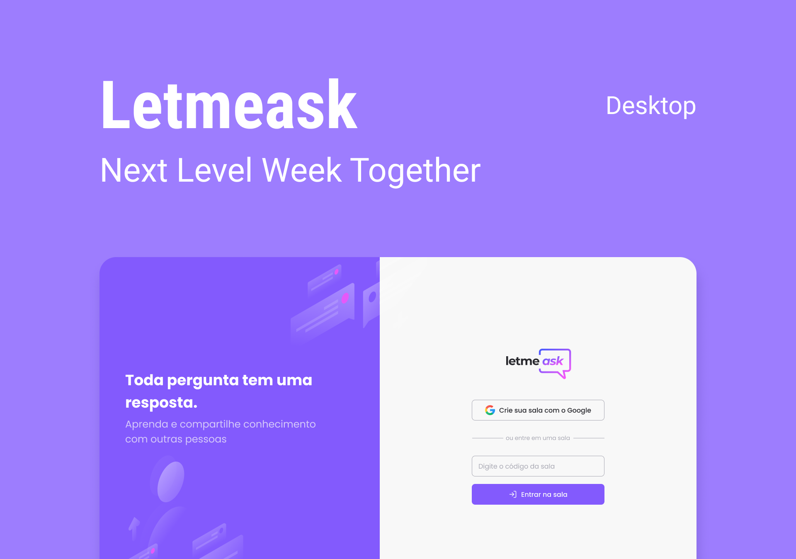

<h1 align="center">
    
     
</h1>

  

  
  

  

  

  

# :rocket: Technologies

- [ReactJS](https://reactjs.org/)
- [TypeScript](https://www.typescriptlang.org/)
- [Styled Components](https://www.styled-components.com/)
- [Polished](https://polished.js.org)
- [Firebase](https://firebase.google.com/)

# `yarn start`

Runs the app in the development mode.\
Open [http://localhost:3000](http://localhost:3000) to view it in the browser.

The page will reload if you make edits.\
You will also see any lint errors in the console.

# `yarn build`

Builds the app for production to the `build` folder.\
It correctly bundles React in production mode and optimizes the build for the best performance.

The build is minified and the filenames include the hashes.\
Your app is ready to be deployed!

See the section about [deployment](https://facebook.github.io/create-react-app/docs/deployment) for more information.

# Figma Design :art:

https://www.figma.com/file/X2kr02oTxzklXbsDbllXuM/Letmeask-(Copy)

# Firebase Deploy

npm install -g firebase-tools

# Login com firebase

firebase login

# Inite Project

firebase init

# Deploy

yarn build && firebase deploy

# :memo: License

This project is under the MIT license. See the [LICENSE](https://github.com/lucianobajr/node-paypal/blob/master/LICENSE) for more information.
